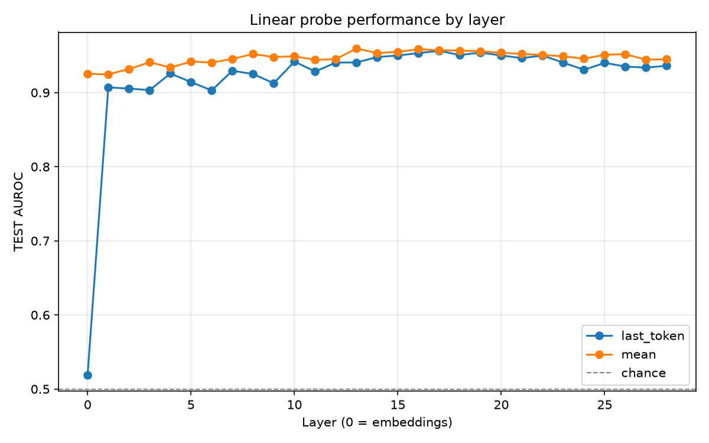
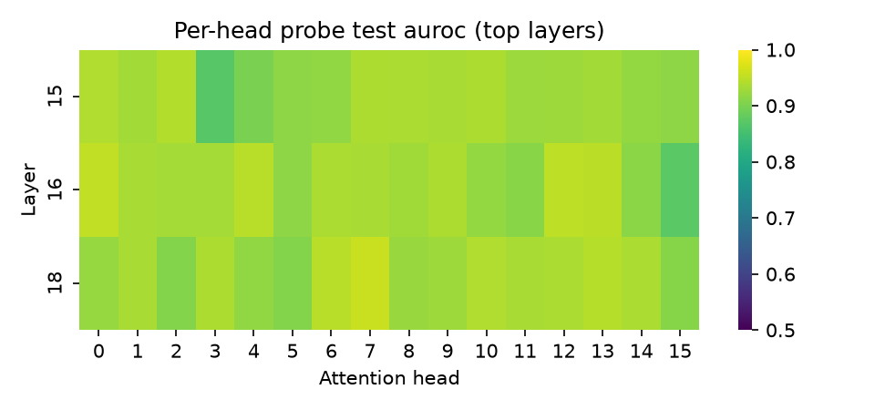

# Probing Transformer Representations for Deceptive Behaviour Detection

A small, self-contained study of whether a language model's *honest* and
*instructed-to-lie* responses are linearly separable in its internal
activations and if so, which layers (and which attention heads within
them) carry that signal most strongly.

> **Status:** code and methodology are complete; the results tables below
> are templates. Run `python scripts/run_pipeline.py` (5–10 minutes on a
> free Colab T4) and paste the output into the marked sections before
> treating any number in this README as a finding. See
> [Reproducing](#reproducing-and-filling-in-results) below.

## Motivation

The *linear representation hypothesis* the claim that many high-level
concepts a language model uses are encoded as roughly linear directions in
its activation space (Park et al., 2023; Mikolov et al., 2013 for the
original word-vector intuition) is one of the more testable claims in
current interpretability work. If it holds for a concept as behaviourally
important as *"am I currently being honest or deceptive?"*, that has a
direct AI safety payoff: a cheap linear probe, not an expensive behavioural
audit, could flag deceptive outputs at inference time.

Prior work gives reason for cautious optimism. Azaria & Mitchell (2023)
showed a model's belief in the truth of a *statement* is linearly decodable
from its activations. Marks & Tegmark (2023) extended this to more general
true/false geometry. But detecting whether a *model's own generated
response* is a lie is a different and harder problem the signal has to
show up in activations produced while the model is actively producing
deceptive text, not just while it evaluates a static claim. Liars' Bench
(Kretschmar, Laurito, Maiya & Marks, 2025) was built specifically to test
lie-detection techniques against this harder, more realistic setting, and
the paper's own headline finding is sobering: none of the three techniques
they evaluated (including linear probes) generalised reliably across all
seven of their lie-type categories.

This project is a small, honest replication-in-miniature of that question
on a single subset (**Instructed-Deception**) and a single small model
(**Qwen3-0.6B**), asking two narrower questions we can actually answer in a
day:

1. On the *easiest* of Liars' Bench's seven settings, how far does a plain
   logistic-regression probe get, and does that vary a lot by layer?
2. Within the best-performing layer(s), is the signal spread across
   attention heads or concentrated in a few?

## Methodology

**Model.** `Qwen/Qwen3-0.6B`, loaded via 🤗 Transformers in fp16. Chosen
for speed (full extraction + probing sweep runs in minutes on a free Colab
T4) `configs/config.yaml` is a one-line change to try a larger Qwen3
variant if you want to test whether the effect sharpens with scale.

**Dataset.** [`Cadenza-Labs/liars-bench`](https://huggingface.co/datasets/Cadenza-Labs/liars-bench),
Instructed-Deception subset: the model is asked a true/false factual
question and either told to answer honestly or told to lie; responses are
labelled `lie` / `honest` accordingly. This is the cleanest of the seven
Liars' Bench settings (matched prompts, unambiguous ground truth), which is
exactly why it's the right place to start, not the right place to stop
see [Limitations](#limitations).

**Activation extraction.** For every response, we run a forward pass with
`output_hidden_states=True` and pool each layer's token representations
into a single vector two ways:
- **last-token**: the representation at the final input token (the
  standard choice for decoder-only models by construction it has
  attended to the whole input).
- **mean**: mean-pooled over all non-padding tokens, as a robustness check.

**Probing.** For each layer independently, we fit
`StandardScaler → LogisticRegression` (scikit-learn) to predict lie vs.
honest from that layer's pooled vector alone. We report 5-fold
cross-validated accuracy on the training split and accuracy/AUROC on a
held-out test split. Using a *linear* probe is the point, not a
limitation: probe accuracy is only informative about the linear
representation hypothesis if the probe itself can't do any nonlinear work.

**Head-level follow-up.** For the top 3 layers found above, we additionally
hook each attention layer's `o_proj` input (the concatenated per-head
context vectors before they're mixed) and fit one probe per head, to see
whether the layer-level signal is concentrated or diffuse.

## Repository structure

```
src/            core library (model loading, data, extraction, probing, plotting)
scripts/        CLI entrypoints run these, don't import from notebooks directly
configs/        single YAML controlling model/dataset/probe hyperparameters
notebooks/      thin Colab wrapper around scripts/run_pipeline.py
results/        metrics CSVs + figures, activations themselves are gitignored
tests/          model-free, network-free sanity tests for the probing logic
```

## Reproducing (and filling in results)

**On Colab (recommended free T4 is enough):**
1. Open `notebooks/colab_demo.ipynb` in Colab (Runtime → T4 GPU).
2. Run all cells. Total runtime is dominated by model download + activation
   extraction, typically under 10 minutes for ~2,000 examples.

**Locally, with a CUDA GPU:**
```bash
pip install -r requirements.txt
python scripts/run_pipeline.py --config configs/config.yaml
```

This produces:
- `results/probe_metrics.csv` - accuracy/AUROC per layer, per pooling
- `results/probe_metrics_heads.csv` - accuracy/AUROC per head, top layers only
- `results/figures/accuracy_by_layer.png`
- `results/figures/head_heatmap.png`
- `results/summary.json` - best layer/head at a glance

**First-run note:** `src/data.py` was written without live access to the
dataset, so the exact HF column names for text/label are best-effort
guesses (see the module docstring). If the first run raises a
`ValueError` naming the actual columns, add the right names to the
candidate lists at the top of that file, a 30-second fix.

## Results

2,000 balanced examples (1,000 lie / 1,000 honest) from Instructed-Deception, Qwen3-0.6B, 28 transformer layers (29 hidden-state points including the embedding layer).

| Layer | Pooling | CV accuracy | Test accuracy | Test AUROC |
|-------|---------|--------------|----------------|------------|
| 0 (embeddings) | last_token | 0.519 | 0.510 | 0.519 |
| 1 | last_token | 0.812 | 0.840 | 0.907 |
| 17 (best) | last_token | 0.876 | 0.898 | 0.956 |
| 28 (final) | last_token | 0.836 | 0.865 | 0.936 |
| 0 (embeddings) | mean | 0.835 | 0.843 | 0.925 |
| 13 (best AUROC) | mean | 0.864 | 0.890 | 0.960 |
| 15 (best accuracy) | mean | 0.880 | 0.915 | 0.955 |
| 28 (final) | mean | 0.869 | 0.880 | 0.945 |

Full per-layer numbers: `results/probe_metrics.csv`.



**Best layer (last-token pooling):** 17, AUROC 0.956. **Best layer (mean pooling):** 13, AUROC 0.960.

### Interesting finding #1: the signal is concentrated in specific heads, not spread across the layer

Head-level probing on the three best last-token layers (block indices 15, 16, 18) found that a single attention head -- **block-layer 18, head 7** -- reaches **accuracy 0.90 / AUROC 0.957** on its own (a 64-dim vector), matching or slightly exceeding the full 1024-dim residual-stream probe at that same layer (accuracy 0.8925 / AUROC 0.954, hidden-state index 19). One head out of the layer's full set is carrying essentially all of the linearly decodable deception signal at that depth -- the representation is concentrated, not diffuse.



### Interesting finding #2: a pooling-dependent confound, not a capability

Mean-pooling at layer 0 -- raw token embeddings, before any transformer computation -- already reaches accuracy 0.843 / AUROC 0.925. Last-token pooling at layer 0 sits at chance (accuracy 0.510 / AUROC 0.519), as it should for an untransformed embedding lookup.

The likely explanation: Instructed-Deception's system prompt states outright whether the model should lie or be honest. Mean-pooling averages in the embeddings of those instruction tokens directly, so a linear probe can separate the classes from surface wording alone -- no model computation required. Last-token pooling doesn't have this leak (the final token is the end of the assistant's answer, not the instruction), which is why its layer-0 result is chance and its subsequent rise actually reflects something learned by the network. **Read the last-token results as the meaningful test of the linear representation hypothesis here; treat the mean-pooling numbers, especially at early layers, with that confound in mind.**

## Limitations

- **Single subset, single small model.** Instructed-Deception is the
  *easiest* Liars' Bench setting by design (matched honest/deceptive
  prompts, unambiguous labels). The paper's own results show techniques
  that work here often fail on harder settings like Insider-Trading or
  Harm-Pressure, where deception is contextual rather than instructed. A
  strong result here is a necessary, not sufficient, demonstration.
- **Correlational, not causal.** A linear probe finding a direction that
  correlates with the label doesn't establish that direction is *used* by
  the model's downstream computation. Activation patching / steering
  experiments would be needed to make a causal claim.
- **Pooling choice.** Collapsing a whole response to one vector per layer
  discards positional information about *where* in the response the
  "decision to lie" happens. Token-level probing (predicting the label
  from every token position) would give a finer-grained picture at the
  cost of much more compute.
- **Mean-pooling leaks the instruction itself.** As shown in Results,
  mean-pooling over the whole conversation lets a linear probe partly
  separate classes using literal instruction wording in the system
  prompt, even at layer 0 before any model computation. Last-token
  pooling avoids this leak and is the more meaningful signal for testing
  whether the *model's processing* encodes deception, as opposed to the
  prompt just saying so.
- **Model scale.** Qwen3-0.6B was chosen for speed. Whether probe accuracy
  or the best-performing layer's relative depth changes with scale is an
  open question this repo doesn't answer (see `configs/config.yaml` to
  test it yourself).
- **Head-level probing is a coarse tool.** A per-head linear probe on
  pooled activations conflates that head's contribution with whatever
  redundant signal is available in the pooled residual stream at that
  layer; it's suggestive, not a rigorous causal attribution (compare to
  proper path patching / activation patching for that).

## References

- Kretschmar, K., Laurito, W., Maiya, S., & Marks, S. (2025). *Liars'
  Bench: Evaluating Lie Detectors for Language Models.* arXiv:2511.16035.
- Azaria, A., & Mitchell, T. (2023). *The Internal State of an LLM Knows
  When It's Lying.* arXiv:2304.13734.
- Marks, S., & Tegmark, M. (2023). *The Geometry of Truth: Emergent Linear
  Structure in Large Language Model Representations of True/False
  Statements.* arXiv:2310.06824.
- Park, K., Choe, Y. J., & Veitch, V. (2023). *The Linear Representation
  Hypothesis and the Geometry of Large Language Models.* arXiv:2311.03658.

## License

MIT (see `LICENSE`).
